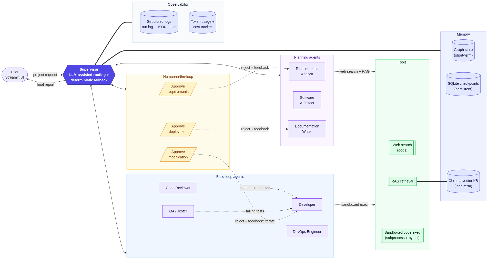

# DevCrew AI — Multi-Agent Software Engineering Team

A supervisor-led AI workforce that turns a plain-English project request into
requirements, architecture, **reviewed and tested code**, documentation, and
deployment files — with a live Streamlit dashboard and human-in-the-loop
approval. Built with **LangGraph** for the *Interactive Multi-Agent AI
System* assignment.



## Team

| Member | Name / GitHub | Module |
|---|---|---|
| Member 1 | _fill in_ | Orchestration: supervisor, graph, HITL, checkpoints (`src/graph/`) |
| Member 2 | _fill in_ | Planning agents + RAG memory (`requirements_analyst`, `architect`, `doc_writer`, `src/memory/`, web search) |
| Member 3 | _fill in_ | Build-loop agents + tools (`developer`, `reviewer`, `tester`, `devops`, `src/tools/`) |
| Member 4 | _fill in_ | UI + observability (`ui/`, `src/observability/`) |

## Quick start

```bash
git clone <this repo> && cd devcrew-ai
python -m venv .venv && source .venv/bin/activate   # Windows: .venv\Scripts\activate
pip install -r requirements.txt
cp .env.example .env
```

**Mock mode (default, no API key, $0):** runs the whole pipeline on canned
outputs — including one full Reviewer -> Developer rework loop — so you can
demo the system and develop the UI for free.

```bash
streamlit run ui/app.py          # dashboard at http://localhost:8501
python run_cli.py                # or in the terminal
python -m pytest -q              # smoke tests
```

**Live mode:** put your key in `.env`, set `MOCK_MODE=0`, and run the same
commands. All 7 agents, the LLM-assisted supervisor, the Chroma RAG memory,
and web search are fully implemented — live mode runs the real pipeline
end to end, not just the Requirements Analyst.

## What the dashboard shows

Agent workflow status, live execution trace, agent-to-agent communication
history, the LangGraph execution graph, token usage + estimated API cost,
execution logs and errors (also on disk in `logs/run.log`), a memory viewer
(shared state + vector knowledge base), human-in-the-loop approve/reject
controls, and the final report with a downloadable zip of the generated
project.

## How it maps to the rubric

| Rubric item | Where |
|---|---|
| Multi-agent architecture (20) | Supervisor + 7 agents, hub-and-spoke LangGraph (`src/graph/build_graph.py`, `docs/architecture.md`) |
| Agent collaboration (15) | Reviewer->Developer and Tester->Developer rework loops; two Human->Agent revision loops (requirements, pre-deployment); `agent_messages` history |
| User interface (15) | `ui/app.py` — 8-tab Streamlit dashboard + HITL sidebar |
| Tool integration (10) | web search (`src/tools/web_search.py`), sandboxed pytest runner (`src/tools/code_exec.py`), OpenAI API |
| Memory (10) | shared `ProjectState` + LangGraph checkpointer (short-term), Chroma vector KB (`src/memory/`) (long-term) |
| Logging & observability (10) | `src/observability/` — state logs, `logs/run.log`, per-agent token/cost tracking |
| Innovation (10) | mock-mode demo fallback, max-revision guardrails, downloadable generated project |

## Repository layout

```
src/graph/          state contract, supervisor, HITL, graph wiring
src/agents/         one file per agent (see base.py for the pattern)
src/tools/          web search, sandboxed code execution
src/memory/         Chroma vector knowledge base (RAG)
src/observability/  logging + token/cost tracking
src/mock/           canned outputs for mock mode
ui/app.py           Streamlit dashboard
tests/              smoke tests (run in mock mode)
docs/               architecture doc + diagram
run_cli.py          terminal runner
```

## Development workflow

Branch `feat/<module>` -> commit small -> PR -> teammate review -> merge.
Everyone commits with their own GitHub identity. `CLAUDE.md` holds the
conventions that our Claude Code sessions (and humans) follow; run
`python -m pytest -q` before every commit.
