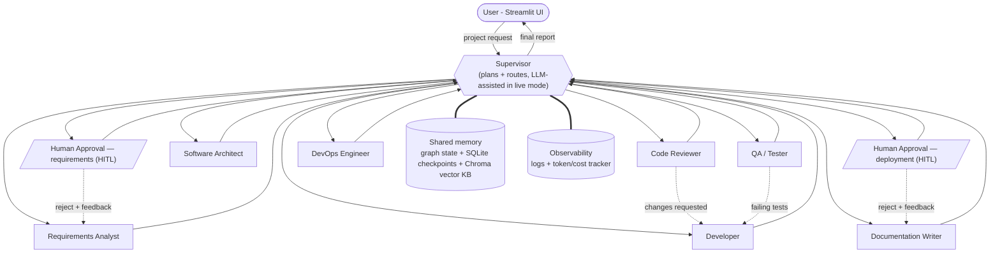

# DevCrew AI — Architecture

Hub-and-spoke supervisor pattern in LangGraph: the Supervisor plans and routes;
every specialized agent reports back to it. Four feedback loops make the
collaboration visible: Reviewer -> Developer (code review), Tester -> Developer
(failing tests), Human -> Requirements Analyst (rejected SRS), and
Human -> Doc Writer (rejected pre-deployment review).

## Layers

| Layer | Where | Owner |
|---|---|---|
| Orchestration (supervisor, routing, HITL, checkpoints) | `src/graph/` | Member 1 |
| Planning & knowledge agents + RAG memory | `src/agents/` (analyst, architect, doc_writer), `src/memory/` | Member 2 |
| Build-loop agents + execution tools | `src/agents/` (developer, reviewer, tester, devops), `src/tools/` | Member 3 |
| UI + observability | `ui/`, `src/observability/` | Member 4 |

## Shared state (the contract)

`src/graph/state.py` defines `ProjectState` — the single shared memory all
agents read/write. Append-only lists (`agent_messages`, `logs`) power the UI's
communication history and log viewer; the `merge_usage` reducer aggregates
per-agent token cost. The LangGraph checkpointer persists state per thread,
which is what makes pause/resume (HITL `interrupt()`) possible.

## Execution flow (happy path with loops)

1. Supervisor -> Requirements Analyst -> SRS drafted
2. Supervisor -> Human approval (graph pauses; UI Approve/Reject)
3. Supervisor -> Architect -> tech stack + design
4. Supervisor -> Developer -> code v1
5. Supervisor -> Reviewer -> CHANGES REQUESTED -> Developer -> code v2 -> Reviewer -> APPROVED
6. Supervisor -> Tester -> pytest PASS (on FAIL: back to Developer)
7. Supervisor -> Doc Writer -> user guide
8. Supervisor -> Human approval (graph pauses; UI Approve/Reject deployment)
9. Supervisor -> DevOps -> Dockerfile + CI
10. Supervisor -> FINISH -> final report to the UI
